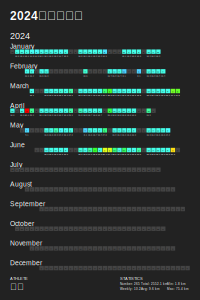
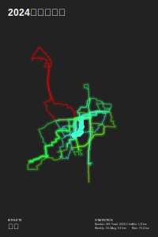
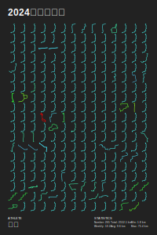

# riding-data
自行车骑行数据仓库

### 简介

日常骑行，装备如下：
- 美利达挑战者300 2019款
- 佳明Edge130/迹驰BSC200码表
- 迈金心率带、踏频器

自2023年开始频繁骑行来，积累了不少骑行数据，例如日常通勤、周末休闲骑等。目前正在探索将这些数据可视化的方法。

### poster

2024年上半年骑行数据汇总，截止到[2024-06-28](reports/2024-06-28.md)。

### 2024年上半年骑行数据汇总

日常通勤每天16KM，占据了骑行距离的一大部分，周末偶尔骑个长距离。从热图和网格图上可以明显的看出通勤的比例……









### 相关脚本

`utils/igps_crawler.py`。从[igpsport](https://my.igpsport.com/account/Login)网页端获取数据。**注意，网页端频繁获取一定数目的数据后，账号将出现成功请求但是数据为空的情况**。用法如下：

```bash
python3 utils/igps_crawler.py \
    -u "username" \
    -p "password" \
    [--debug] \
    --download \
    --out-dir 2024 \
    --page_start 1 \
    --page_end 1 \
    --fit \
    [--gpx] \
    [--tcx] \
    [--json igps.saved_activities.json]
```
